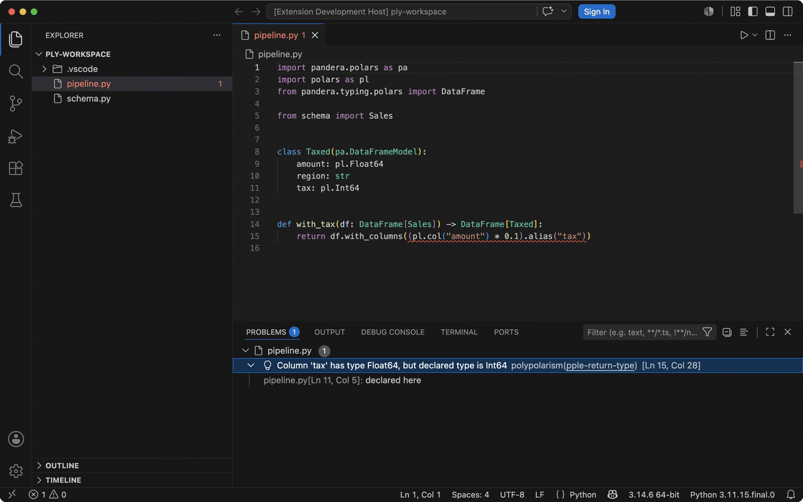

# Polypolarism VSCode Extension

Static type checker for Polars DataFrames based on row polymorphism.

## Demo



*A single `with_tax` function: the typed return-column mismatch is flagged
inline, schema hover shows the declared vs inferred frames, a QuickFix retypes
the declared field, and a column rename propagates across files.*

## Features

- Real-time type checking for Polars DataFrame operations
- Shows errors and warnings in the Problems panel and inline in the editor
- Diagnostics carry their stable polypolarism code (`pple-*` errors,
  `pplw-*` warnings — e.g. `pple-return-type`, `pplw-unmodeled-method`); the
  code links to the corresponding table in the
  [polypolarism diagnostics reference](https://github.com/ngr-t/polypolarism/blob/main/docs/diagnostics.md#diagnostic-codes)
- Diagnostics point at the precise location: function-level findings mark
  the `def` name, and typed return-column mismatches underline the
  offending expression and link to the `declared here` schema field
  (LSP related information)
- Files that fail to parse are reported as a syntax-error diagnostic
- Schema hover: hovering inside a checked function shows polypolarism's
  view of it — per-parameter frames and the declared vs inferred return
  frames (an `...` marks open frames that may carry extra columns)
- QuickFix code actions: the lightbulb offers concrete edits for some
  diagnostics — make an over-constrained parameter a bare `pl.DataFrame`
  (`pple-undeclared-column`), align a declared schema field with the inferred
  dtype, or declare an undeclared extra column on a strict schema
  (`pple-return-type`). Fixes
  are only offered when the edit can be resolved unambiguously.
- Rename a column: renaming a schema field (or a `pl.col("...")` reference)
  rewrites the field declaration and every reference polypolarism can
  prove points at the same `(schema, column)`, **across files**. Only
  occurrences with a proven origin are touched, and the new name must be a
  valid Python identifier (the schema field is renamed too). Edits in
  files other than the one you triggered the rename in are grouped for
  confirmation in the refactor preview, so the multi-file effect is
  explicit before you apply it.
- Checks on file open and save

## Requirements

- VS Code 1.78.0 or greater
- Python 3.11 or higher
- `polypolarism` package installed in your Python environment
  (recommended; see [Installation](#installation))
- polypolarism's supported window: Polars `1.37+`, Pandera `0.19+`
  (older versions are best-effort and flagged by a `pplw-unsupported-version` warning;
  see [Supported versions](https://github.com/ngr-t/polypolarism#supported-versions))

## Installation

The extension is not on the Marketplace yet, so install the built `.vsix`
manually:

1. Build the `.vsix` file — see [`docs/development.md`](docs/development.md)
2. Install via command line:
   ```bash
   code --install-extension polypolarism.vsix
   ```
   Or on macOS if `code` command is not available:
   ```bash
   "/Applications/Visual Studio Code.app/Contents/Resources/app/bin/code" --install-extension polypolarism.vsix
   ```

3. Install polypolarism in your Python environment:
   ```bash
   # From GitHub (polypolarism is not yet on PyPI)
   pip install git+https://github.com/ngr-t/polypolarism.git
   ```

4. Set `polypolarism.importStrategy` to `fromEnvironment` (recommended:
   the bundled copy is only a fallback snapshot and may lag behind the
   version you installed)

5. Reload VSCode window

## Usage

Declare schemas as Pandera `DataFrameModel` classes and annotate your
functions with `DataFrame[Schema]` / `LazyFrame[Schema]`:

```python
import pandera.polars as pa
import polars as pl
from pandera.typing.polars import DataFrame


class Users(pa.DataFrameModel):
    id: int
    name: str


class ActiveUsers(pa.DataFrameModel):
    id: int
    name: str
    active: bool


def process_users(users: DataFrame[Users]) -> DataFrame[ActiveUsers]:
    return users.with_columns(pl.lit(True).alias("active"))
```

The extension will automatically check your code on open and save and
report any type mismatches.

## Diagnostics

| Kind | Codes | Shown as |
|---|---|---|
| Errors | `pple-*` (e.g. `pple-return-type`) | Problems panel **Error** |
| Warnings | `pplw-*` (e.g. `pplw-unmodeled-method`) | Problems panel **Warning** |

polypolarism uses semantic slug codes (`pple-<slug>` for errors,
`pplw-<slug>` for warnings); it previously used numeric `PLY###` / `PLW###`
codes (see the [legacy code mapping](https://github.com/ngr-t/polypolarism/blob/main/docs/diagnostics.md#legacy-code-mapping-one-time-scheme-change)).
Each diagnostic's code links to its description in the polypolarism
diagnostics reference ([error table](https://github.com/ngr-t/polypolarism/blob/main/docs/diagnostics.md#diagnostic-codes),
[warning table](https://github.com/ngr-t/polypolarism/blob/main/docs/diagnostics.md#apply-style-helpers-and-warning-codes)).
Files that cannot be parsed produce an uncoded `SyntaxError` diagnostic
instead of being silently skipped.

## Configuration

- `polypolarism.args`: Additional arguments to pass to polypolarism
- `polypolarism.path`: Custom path to polypolarism executable
- `polypolarism.interpreter`: Python interpreter to use
- `polypolarism.importStrategy`: Where to import polypolarism from (`useBundled` or `fromEnvironment`; `fromEnvironment` is recommended while polypolarism is not on PyPI)
- `polypolarism.showNotifications`: When to show notifications (`off`, `onError`, `onWarning`, `always`)

## Commands

- `Polypolarism: Restart Server` - Restart the language server

## Contributing

Build, debug, and packaging instructions live in
[`docs/development.md`](docs/development.md).

## Troubleshooting

### "No matching distribution found for polypolarism"

polypolarism is not yet published to PyPI. Install it from GitHub:
```bash
pip install git+https://github.com/ngr-t/polypolarism.git
```

### Extension not detecting polypolarism

1. Make sure polypolarism is installed in the Python environment VSCode is using
2. Check `polypolarism.importStrategy` setting:
   - `useBundled`: Uses the polypolarism snapshot bundled with the extension
   - `fromEnvironment`: Uses polypolarism from your Python environment (recommended — keeps you on the version you installed from GitHub)

## License

MIT
